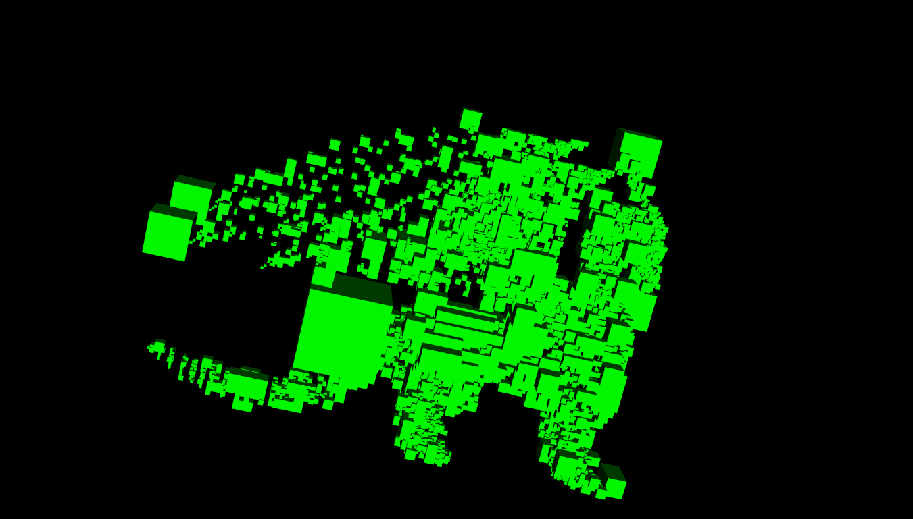
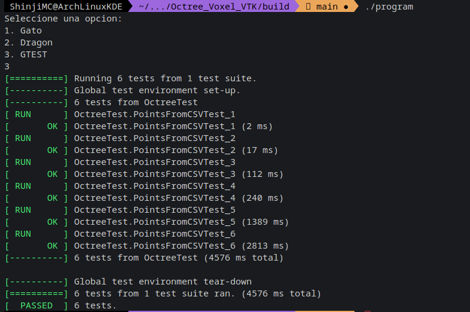

# Octree with VTK in C++ [ENG]

@ShinjiMC - By Braulio Nayap Maldonado Casilla

A simple Octree structure that can build up on the Point Clouds

## Build

```
    mkdir build
    cd build
    cmake -DBUILD_EXAMPLE=ON ..
    cmake --build .
    ./program
```


## Components

### Googletest

- **Description**: Contains essential files for performing unit tests with Google Test (gtest).

### Octree

- **Description**: Represents a data structure that defines an Octree in a three-dimensional space. It divides space into consecutive octants and enables storing points in a 3D design.
- **Key Functions**:
  - `insert()`: Adds a point to the Octree.
  - `find()`: Searches for a point in the Octree.
  - `print()`: Prints the structure of the Octree.
  - `getroot()`: Returns the root node of the Octree.

### Reader

- **Description**: Reads CSV files to convert and store points into the Octree structure.
- **Key Functions**:
  - `readAndConvert()`: Reads a CSV file and converts its points into the Octree structure.

### Tester

- **Description**: Contains unit tests using Google Test (gtest) to verify the functionality of the Octree structure and Vtk_Builder.
- **Key Functions**:
  - `testPointsOctree()`: Performs tests to ensure the correct storage of points in the Octree.
  - `testLoadRenderInteractClear()`: Verifies the loading, rendering, interaction, and clearing functions of Vtk_Builder with the Octree.

### Vec3D

- **Description**: Simulates a three-dimensional point and includes common mathematical operations for points in a 3D space.
- **Key Operations**:
  - Operator Overloading: `+, -, *, /, ==, !=` for performing mathematical operations and comparisons between points.

### Vtk_Builder

- **Description**: Loads data from the Octree to a VTK (Visualization Toolkit) processor to visually represent them.
- **Key Functions**:
  - `loadOctree()`: Loads data from the Octree to VTK.
  - `addCubeActor()`: Adds a cubic actor to the VTK rendering.
  - `render()`: Renders the scene using VTK.
  - `startInteractor()`: Initiates interaction with the rendered scene.
  - `clear()`: Clears previously loaded actors in VTK.

### CMake Parameters

- **BUILD_EXAMPLE**: Controls the construction of program examples.
- **SILENCE_DEBUG_OUTPUT**: Controls the debug output in the program.

## Proyect

The project focuses on loading points stored in a CSV file into an Octree and subsequently visualizing them using VTK.

### Octree Functionality

The Octree is a hierarchical data structure that divides three-dimensional space into octants. Each octant can contain specific spatial points. Points are stored within this tree, allowing for quick data search, insertion, and retrieval.

### Loading and Storing Process

Points from a CSV file are read and converted into spatial objects using the Octree data structure. This conversion process involves distributing the points into their respective Octree octants.

### Visualization using VTK (Visualization Toolkit)

Once the points are stored in the Octree structure, VTK capabilities are used to visualize this data. VTK handles the graphical representation of both individual points and the octants that store these points in a three-dimensional space. Moreover, points or octants can be visualized separately based on user preferences.

### Project Objectives

1. **Point Loading and Storage**: Reading points from CSV files and storing them in an Octree.
2. **Graphical Representation with VTK**: Utilizing VTK to visualize individual points and octants stored in the Octree.
3. **Visualization Flexibility**: Allowing selective visualization of points or octants according to user preferences.

## Results

### Cat Model Visualization

#### Cat with Voxels

This image shows the visualization of a cat model represented using voxels. Voxels are the occupied octants in the octree structure. Each voxel represents an octant in the 3D space where points from the cat model are located.


#### Cat with Points

This image displays the cat model represented by points within the octree structure. Each point in the visualization represents a specific coordinate within the 3D space where a part of the cat model is located.


#### Cat with Points and Voxels

This visualization combines both the point representation and the voxels (occupied octants) to provide a comprehensive view of the cat model within the octree.


### Dragon Model Visualization

#### Dragon with Voxels

Similar to the cat model, this image shows the dragon model represented using voxels. Voxels are the occupied octants in the octree structure that correspond to different parts of the dragon model.



#### Dragon with Points

This image presents the dragon model represented by points distributed within the octree. Each point denotes a specific coordinate in the 3D space where a part of the dragon model is positioned.


#### Dragon with Points and Voxels

Combining the point representation with the occupied octants (voxels) provides a complete visualization of the dragon model within the octree.


### Google Test (GTEST) Results

#### GTEST without VTK

This image illustrates the test results generated by Google Test (GTEST) without any visualization using VTK (Visualization Toolkit). It possibly represents the test outcomes, such as pass/fail status or any other relevant information.



#### GTEST with VTK

In contrast to the previous image, this one demonstrates the test results from Google Test (GTEST) along with VTK visualization. It likely represents test outcomes with accompanying visual representations or feedback through VTK.


## Conclusion

The Octree with VTK project showcases a robust system capable of handling point cloud data efficiently. Leveraging the Octree data structure, the project successfully stores, manages, and visualizes three-dimensional spatial data.

### Key Achievements

1. **Data Structuring**: The Octree structure efficiently organizes and manages spatial points in an octant-based hierarchy, enabling rapid point insertion, retrieval, and search operations.

2. **Visualization Capabilities**: Utilizing VTK, the project achieves compelling visual representations of the stored data. This includes rendering points as well as occupied octants (voxels) representing specific regions in 3D space.

3. **Testing Reliability**: Google Test (GTEST) ensures the robustness and reliability of the Octree and VTK functionalities. It verifies the correctness of data insertion, rendering, and interaction capabilities without VTK and with VTK visualizations.

4. **User Flexibility**: The system provides users with the flexibility to choose between point and octant visualization based on their requirements, enhancing the overall user experience.

### Project Contributions

- **Efficient Spatial Data Handling**: Offers a versatile solution for managing and visualizing spatial data efficiently.
- **Testing and Validation**: Rigorous testing using GTEST ensures the accuracy and reliability of the implemented functionalities.

- **Visualization Toolkit Integration**: Successful integration of VTK enables the visualization of complex spatial data structures with clarity and precision.

### Future Directions

- **Enhanced Visualization Options**: Expand the visualization options to allow more advanced rendering techniques, providing users with diverse visualization modes and styles.

- **Performance Optimization**: Focus on optimizing the performance of the Octree structure and rendering processes for handling larger datasets seamlessly.

- **User Interface Refinement**: Refine the user interface to enhance user interaction and customization capabilities, making it more intuitive and user-friendly.

The Octree with VTK project serves as a robust foundation for managing and visualizing spatial data efficiently. Its capabilities, ranging from data structuring to visualization, pave the way for future advancements in handling complex 3D spatial data.

# Octree with VTK en C++ [ESP]

@ShinjiMC - Por Braulio Nayap Maldonado Casilla

Una estructura simple de Octree que puede construirse sobre los Conjuntos de Puntos

## Construcción

```
    mkdir build
    cd build
    cmake -DBUILD_EXAMPLE=ON ..
    cmake --build .
    ./program
```


## Componentes

### Googletest

- **Descripción**: Contiene archivos esenciales para realizar pruebas unitarias con Google Test (gtest).

### Octree

- **Descripción**: Representa una estructura de datos que define un Octree en un espacio tridimensional. Divide el espacio en octantes consecutivos y permite almacenar puntos en un diseño 3D.
- **Funciones Clave**:
  - `insert()`: Agrega un punto al Octree.
  - `find()`: Busca un punto en el Octree.
  - `print()`: Imprime la estructura del Octree.
  - `getroot()`: Devuelve el nodo raíz del Octree.

### Reader

- **Descripción**: Lee archivos CSV para convertir y almacenar puntos en la estructura del Octree.
- **Funciones Clave**:
  - `readAndConvert()`: Lee un archivo CSV y convierte sus puntos en la estructura del Octree.

### Tester

- **Descripción**: Contiene pruebas unitarias utilizando Google Test (gtest) para verificar la funcionalidad de la estructura del Octree y Vtk_Builder.
- **Funciones Clave**:
  - `testPointsOctree()`: Realiza pruebas para asegurar el almacenamiento correcto de puntos en el Octree.
  - `testLoadRenderInteractClear()`: Verifica las funciones de carga, renderizado, interacción y limpieza de Vtk_Builder con el Octree.

### Vec3D

- **Descripción**: Simula un punto tridimensional e incluye operaciones matemáticas comunes para puntos en un espacio 3D.
- **Operaciones Clave**:
  - Sobrecarga de Operadores: `+, -, *, /, ==, !=` para realizar operaciones matemáticas y comparaciones entre puntos.

### Vtk_Builder

- **Descripción**: Carga datos del Octree a un procesador VTK (Visualization Toolkit) para representarlos visualmente.
- **Funciones Clave**:
  - `loadOctree()`: Carga datos del Octree a VTK.
  - `addCubeActor()`: Agrega un actor cúbico a la representación de VTK.
  - `render()`: Representa la escena usando VTK.
  - `startInteractor()`: Inicia la interacción con la escena renderizada.
  - `clear()`: Borra actores previamente cargados en VTK.

### Parámetros de CMake

- **BUILD_EXAMPLE**: Controla la construcción de ejemplos de programas.
- **SILENCE_DEBUG_OUTPUT**: Controla la salida de depuración en el programa.

## Proyecto

El proyecto se enfoca en cargar puntos almacenados en un archivo CSV en un Octree y posteriormente visualizarlos usando VTK.

### Funcionalidad del Octree

El Octree es una estructura de datos jerárquica que divide el espacio tridimensional en octantes. Cada octante puede contener puntos espaciales específicos. Los puntos se almacenan dentro de este árbol, lo que permite búsquedas, inserciones y recuperaciones de datos rápidas.

### Proceso de Carga y Almacenamiento

Los puntos de un archivo CSV se leen y convierten en objetos espaciales utilizando la estructura de datos del Octree. Este proceso de conversión implica distribuir los puntos en sus respectivos octantes del Octree.

### Visualización usando VTK (Visualization Toolkit)

Una vez que los puntos están almacenados en la estructura del Octree, se utilizan las capacidades de VTK para visualizar estos datos. VTK maneja la representación gráfica tanto de puntos individuales como de los octantes que almacenan estos puntos en un espacio tridimensional. Además, los puntos u octantes pueden visualizarse por separado según las preferencias del usuario.

### Objetivos del Proyecto

1. **Carga y Almacenamiento de Puntos**: Leer puntos de archivos CSV y almacenarlos en un Octree.
2. **Representación Gráfica con VTK**: Utilizar VTK para visualizar puntos individuales y octantes almacenados en el Octree.
3. **Flexibilidad de Visualización**: Permitir la visualización selectiva de puntos u octantes según las preferencias del usuario.

## Resultados

### Visualización del Modelo de Gato

#### Gato con Vóxeles

Esta imagen muestra la visualización de un modelo de gato representado utilizando vóxeles. Los vóxeles son los octantes ocupados en la estructura del octree. Cada vóxel representa un octante en el espacio 3D donde se encuentran los puntos del modelo de gato.


#### Gato con Puntos

Esta imagen muestra el modelo de gato representado por puntos dentro de la estructura del octree. Cada punto en la visualización representa una coordenada específica dentro del espacio 3D donde se encuentra una parte del modelo de gato.


#### Gato con Puntos y Vóxeles

Esta visualización combina tanto la representación de puntos como los vóxeles (octantes ocupados) para proporcionar una vista completa del modelo de gato dentro del octree.


### Visualización del Modelo de Dragón

#### Dragón con Vóxeles

Similar al modelo de gato, esta imagen muestra el modelo de dragón representado utilizando vóxeles. Los vóxeles son los octantes ocupados en la estructura del octree que corresponden a diferentes partes del modelo de dragón.


#### Dragón con Puntos

Esta imagen presenta el modelo de dragón representado por puntos distribuidos dentro del octree. Cada punto denota una coordenada específica en el espacio 3D donde se posiciona una parte del modelo de dragón.


#### Dragón con Puntos y Vóxeles

Combinar la representación de puntos con los octantes ocupados (vóxeles) proporciona una visualización completa del modelo de dragón dentro del octree.


### Resultados de Google Test (GTEST)

#### GTEST sin VTK

Esta imagen ilustra los resultados de prueba generados por Google Test (GTEST) sin ninguna visualización usando VTK (Visualization Toolkit). Posiblemente representa los resultados de prueba, como el estado de aprobación/fallo u otra información relevante.


#### GTEST con VTK

En contraste con la imagen anterior, esta muestra los resultados de prueba de Google Test (GTEST) junto con la visualización de VTK. Probablemente represente los resultados de las pruebas con representaciones visuales o comentarios a través de VTK.


## Conclusiones

El proyecto de Octree con VTK muestra un sistema robusto capaz de manejar eficientemente datos de nubes de puntos. Al aprovechar la estructura de datos del Octree, el proyecto almacena, gestiona y visualiza datos espaciales tridimensionales con éxito.

### Logros Clave

1. **Estructuración de Datos**: La estructura del Octree organiza y gestiona eficientemente puntos espaciales en una jerarquía basada en octantes, permitiendo operaciones rápidas de inserción, recuperación y búsqueda de puntos.

2. **Capacidades de Visualización**: Utilizando VTK, el proyecto logra representaciones visuales convincentes de los datos almacenados. Esto incluye la representación de puntos, así como octantes ocupados (vóxeles) que representan regiones específicas en el espacio 3D.

3. **Fiabilidad de Pruebas**: Google Test (GTEST) garantiza la robustez y confiabilidad de las funcionalidades del Octree y VTK. Verifica la corrección de la inserción de datos, representación e interacción sin VTK y con visualizaciones de VTK.

4. **Flexibilidad para el Usuario**: El sistema proporciona a los usuarios la flexibilidad de elegir entre la visualización de puntos o octantes según sus requisitos, mejorando la experiencia general del usuario.

### Contribuciones del Proyecto

- **Manejo Eficiente de Datos Espaciales**: Ofrece una solución versátil para gestionar y visualizar datos espaciales de manera eficiente.
- **Pruebas y Validación**: Pruebas rigurosas con GTEST aseguran la precisión y fiabilidad de las funcionalidades implementadas.
- **Integración del Toolkit de Visualización**: La integración exitosa de VTK permite la visualización de estructuras de datos espaciales complejas con claridad y precisión.

### Futuras Direcciones

- **Mejora de Opciones de Visualización**: Ampliar las opciones de visualización para permitir técnicas de renderizado más avanzadas, proporcionando a los usuarios diversos modos y estilos de visualización.

- **Optimización de Rendimiento**: Enfocarse en optimizar el rendimiento de la estructura del Octree y los procesos de renderizado para manejar conjuntos de datos más grandes de manera fluida.

- **Refinamiento de la Interfaz de Usuario**: Mejorar la interfaz de usuario para potenciar la interacción del usuario y las capacidades de personalización, haciéndola más intuitiva y amigable.

El proyecto Octree con VTK sirve como una sólida base para gestionar y visualizar datos espaciales de manera eficiente. Sus capacidades, que van desde la estructuración de datos hasta la visualización, allanan el camino para futuros avances en el manejo de datos espaciales tridimensionales complejos.
